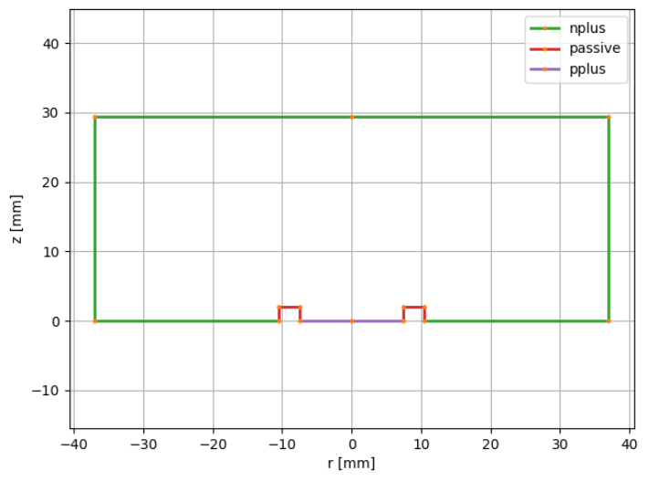
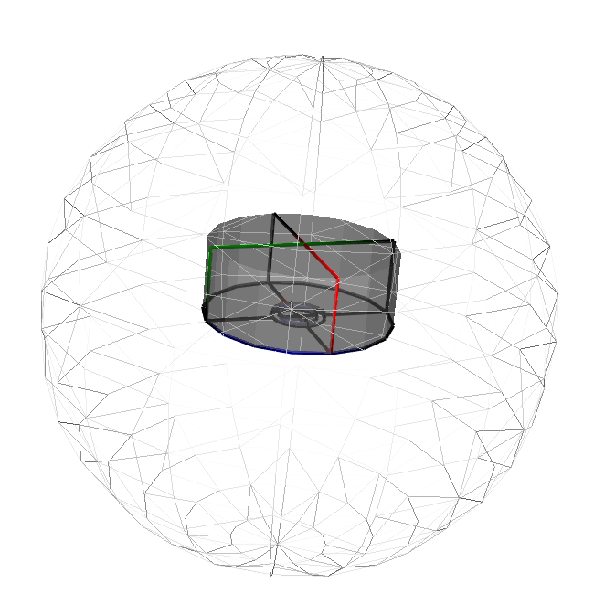

Basic User Manual
=================

This package implements a ``HPGe`` which describes the detector geometry and can be used for:

- visualisation with `pyg4ometry <https://pyg4ometry.readthedocs.io/en/stable/>`_
- exporting to GDML for Geant4 simulations (again with pyg4ometry),
- computing detector properties.

Metadata specification
----------------------

The detector geometry is constructed based on the LEGEND metadata specification `(metadata-docs) <https://github.com/legend-exp/legend-detectors/tree/main/germanium/diodes>`_.
This consists of a JSON file (or python dictionary) describing the geometry for example:

.. code-block:: python

    metadata = {
        "name": "B00000B",
        "type": "bege",
        "production": {
            "enrichment": {"val": 0.9, "unc": 0.003},
            "mass_in_g": 697.0,
        },
        "geometry": {
            "height_in_mm": 29.46,
            "radius_in_mm": 36.98,
            "groove": {"depth_in_mm": 2.0, "radius_in_mm": {"outer": 10.5, "inner": 7.5}},
            "pp_contact": {"radius_in_mm": 7.5, "depth_in_mm": 0},
            "taper": {
                "top": {"angle_in_deg": 0.0, "height_in_mm": 0.0},
                "bottom": {"angle_in_deg": 0.0, "height_in_mm": 0.0},
            },
        },
    }

.. note::
    Currently bege, icpc, ppc and coax geometries are implemented as well as a few LEGEND detectors with special geometries.
    Different geometries can be implemented as subclasses deriving from ``legendhpges.base.HPGe``.

The different keys of the dictionary describe the different aspects of the geometry.
Some are self explanatory, for others:

- "production": gives information on the detector production, we need the "enrichment" to define the detector material,
- "geometry"  : gives the detector geometry in particular, "groove" and "pp_contact" describe the contacts of detector.

Other fields can be added to describe different geometry features (more details in the legend metadata documentation).

Constructing the HPGe object
----------------------------

The HPGe object can be constructed from the metadata with:

.. code-block:: python

    from legendhpges import make_hpge
    import pyg4ometry as pg4

    reg = pg4.geant4.Registry()
    hpge = make_hpge(metadata, name="det_L")

The metadata can either be passed as a python dictionary or a path to a JSON file.

Detector properties
-------------------

Most detectors are described by a ``G4GenericPolycone`` (:class:`pyg4ometry.geant4.solid.GenericPolycone`)
This describes the solid by a series of (r,z) pairs rotated around the z axis.

There are methods to plot the (r,z) profile of the detector, in addition this is able to label the contact type (p+,n+ or passivated) each surface
corresponds to (based on the metadata).

.. code-block:: python

    from legendhpges import draw

    draw.plot_profile(hpge, split_by_type=True)

We can also directly extract the r,z profile and the surface types and surface area of each.

.. code-block:: python

    r, z = hpge.get_profile()
    surfaces = hpge.surfaces
    area = hpge.surface_area()
    print(f"total area {sum(area)}")

.. code-block:: console

    total area 13775.325839135963 mm²

Here the surfaces correspond to the line from :math:`r_i` to :math:`r_{i+1}` and :math:`z_i` to :math:`z_{i+1}`.

We can also easily extract the detector mass and volume:

.. code-block:: python

    print(f"mass   {hpge.mass}")
    print(f"volume {hpge.volume}")

.. code-block:: text

    mass   700.5770262065953 g
    volume 126226.52555880952 mm³

Finally we can compute the distance of a set of points to the electrodes and check whether a point is inside the detector.
mm

Use in a Geant4 simulation
--------------------------

The HPGe object derives from :class:`pyg4ometry.geant4.LogicalVolume` and can be used to visualise the detector in 3D, or to run Geant4 simulations.

For example to visualise a detector we can use:

.. code-block:: python

    # create a world volume
    world_s = pg4.geant4.solid.Orb("World_s", 20, registry=reg, lunit="cm")
    world_l = pg4.geant4.LogicalVolume(world_s, "G4_Galactic", "World", registry=reg)
    reg.setWorld(world_l)

    # place the detector
    pg4.geant4.PhysicalVolume(
        [0, 0, 0], [0, 0, 0, "cm"], hpge, "det", world_l, registry=reg
    )

    viewer = pg4.visualisation.VtkViewerColoured()
    viewer.addLogicalVolume(reg.getWorldVolume())
    viewer.view()

The `(remage-tutorial) <https://remage.readthedocs.io/en/stable/>`_ gives a more complete example of using legendhpges to run a simulation.

This class is also the basis of the *legend-pygeom-l200* implementation of the LEGEND-200 experiment `(legend-pygeom-l200 docs) <https://github.com/legend-exp/legend-pygeom-l200>`_ (**private**),
